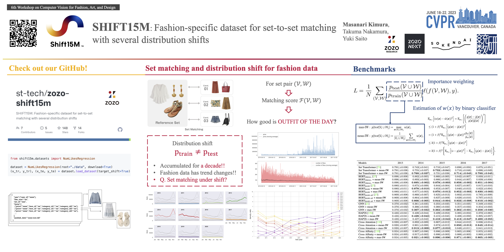

<p align="center">
  
</p>

[](https://opensource.org/licenses/MIT)
[](https://www.python.org)

[](https://pepy.tech/project/shift15m)
[](https://badge.fury.io/py/shift15m)


[](https://arxiv.org/abs/2108.12992)


# SHIFT15M: Fashion-specific dataset for set-to-set matching with several distribution shifts
- [[arXiv]](https://arxiv.org/abs/2108.12992)
- [[CVPRW2023]](https://openaccess.thecvf.com/content/CVPR2023W/CVFAD/papers/Kimura_SHIFT15M_Fashion-Specific_Dataset_for_Set-to-Set_Matching_With_Several_Distribution_Shifts_CVPRW_2023_paper.pdf)
- accepted at CVPR2023 workshop on [CVFAD](https://sites.google.com/view/cvfad2023/home?authuser=0)

Set-to-set matching is the problem of matching two different sets of items based on some criteria. Especially when each item in the set is high-dimensional, such as an image, set-to-set matching is treated as one of the applied problems to be solved by utilizing neural networks. Most machine learning-based set-to-set matching generally assumes that the training and test data follow the same distribution. However, such assumptions are often violated in real-world machine learning problems. In this paper, we propose SHIFT15M, a dataset that can be used to properly evaluate set-to-set matching models in situations where the distribution of data changes between training and testing. Some benchmark experiments show that the performance of naive methods drops due to the effects of the distribution shift. In addition, we provide software to handle the SHIFT15M dataset in a very simple way. The URL for the software will appear after this manuscript is published.

<p align="center">
  
</p>

We provide the [Datasheet for SHIFT15M](./DATASHEET.md).
This datasheet is based on the [Datasheets for Datasets](https://arxiv.org/abs/1803.09010) [1] template.

|      System       |                              Python 3.6                              |                              Python 3.7                              |                              Python 3.8                              |
| :---------------: | :------------------------------------------------------------------: | :------------------------------------------------------------------: | :------------------------------------------------------------------: |
|     Linux CPU     |  |  |  |
|     Linux GPU     |  |  |  |
| Windows CPU / GPU |     |      |   |
|    Mac OS CPU     |  |  |  |

SHIFT15M is a large-scale dataset based on approximately 15 million items accumulated by the fashion search service IQON.

## Installation

### From PyPi

```bash
$ pip install shift15m
```

### From source

```bash
$ git clone https://github.com/st-tech/zozo-shift15m.git
$ cd zozo-shift15m
$ poetry build
$ pip install dist/shift15m-xxxx-py3-none-any.whl
```

## Download SHIFT15M dataset

### Use Dataset class

You can download SHIFT15M dataset as follows:

```python
from shift15m.datasets import NumLikesRegression

dataset = NumLikesRegression(root="./data", download=True)
(x_train, y_train), (x_test, y_test) = dataset.load_dataset(target_shift=True)
```

### Download directly by using download scripts

Please download the dataset as follows:

```bash
$ bash scripts/download_all.sh
```

## Tasks

The following tasks are now available:

| Tasks                                                                                                                  | Task type           | Shift type                    | # of input dim      | # of output dim |
| ---------------------------------------------------------------------------------------------------------------------- | ------------------- | ----------------------------- | ------------------- | --------------- |
| [NumLikesRegression](https://github.com/st-tech/zozo-shift15m/tree/main/benchmarks#regression-for-the-number-of-likes) | regression          | target shift                  | (N, 25)             | (N, 1)          |
| [SumPricesRegression](https://github.com/st-tech/zozo-shift15m/tree/main/benchmarks#regression-for-the-sum-of-prices)  | regression          | covariate shift, target shift | (N, 1)              | (N, 1)          |
| ItemPriceRegression                                                                                                    | regression          | target shift                  | (N, 4096)           | (N, 1)          |
| [ItemCategoryClassification](https://github.com/st-tech/zozo-shift15m/tree/main/benchmarks/item_category_prediction)   | classification      | target shift                  | (N, 4096)           | (N, 7)          |
| [Set2SetMatching](https://github.com/st-tech/zozo-shift15m/tree/main/benchmarks/set_matching)                          | set-to-set matching | covariate shift               | (N, 4096)x(M, 4096) | (1)             |

## Benchmarks

As templates for numerical experiments on the SHIFT15M dataset, we have published [experimental results for each task with several models](./benchmarks).

## Original Dataset Structure

The original dataset is maintained in json format, and a row consists of the following:

```
{
  "user":{"user_id":"xxxx", "fav_brand_ids":"xxxx,xx,..."},
  "like_num":"xx",
  "set_id":"xxx",
  "items":[
    {"price":"xxxx","item_id":"xxxxxx","category_id1":"xx","category_id2":"xxxxx"},
    ...
  ],
  "publish_date":"yyyy-mm-dd",
  "tags": "tag_a, tag_b, tag_c, ..."
}
```

## Contributing

To learn more about making a contribution to SHIFT15M, please see the following materials:

- [Developers Guide](./DEVELOPMENT.md)
- [Task Proposal Guide](./TASK_PROPOSAL.md)
- [Benchmark Proposal Guide](./BENCHMARK.md)

## License

The dataset itself is provided under a [CC BY-NC 4.0 license](./LICENSE.CC).
On the other hand, the software in this repository is provided under the [MIT license](./LICENSE.MIT).

## Dataset metadata

The following table is necessary for this dataset to be indexed by search engines such as [Google Dataset Search](https://datasetsearch.research.google.com/).

<div itemscope itemtype="http://schema.org/Dataset">
<table>
  <tr>
    <th>property</th>
    <th>value</th>
  </tr>
  <tr>
    <td>name</td>
    <td><code itemprop="name">SHIFT15M Dataset</code></td>
  </tr>
  <tr>
    <td>alternateName</td>
    <td><code itemprop="alternateName">SHIFT15M</code></td>
  </tr>
  <tr>
    <td>alternateName</td>
    <td><code itemprop="alternateName">shift15m-dataset</code></td>
  </tr>
  <tr>
    <td>url</td>
    <td><code itemprop="url">https://github.com/st-tech/zozo-shift15m</code></td>
  </tr>
  <tr>
    <td>sameAs</td>
    <td><code itemprop="sameAs">https://github.com/st-tech/zozo-shift15m</code></td>
  </tr>
  <tr>
    <td>description</td>
    <td><code itemprop="description">SHIFT15M is a multi-objective, multi-domain dataset which includes multiple dataset shifts.</code></td>
  </tr>
  <tr>
    <td>provider</td>
    <td>
      <div itemscope itemtype="http://schema.org/Organization" itemprop="provider">
        <table>
          <tr>
            <th>property</th>
            <th>value</th>
          </tr>
          <tr>
            <td>name</td>
            <td><code itemprop="name">ZOZO Research</code></td>
          </tr>
          <tr>
            <td>sameAs</td>
            <td><code itemprop="sameAs">https://ja.wikipedia.org/wiki/ZOZO</code></td>
          </tr>
        </table>
      </div>
    </td>
  </tr>
  <tr>
    <td>license</td>
    <td>
      <div itemscope itemtype="http://schema.org/CreativeWork" itemprop="license">
        <table>
          <tr>
            <th>property</th>
            <th>value</th>
          </tr>
          <tr>
            <td>name</td>
            <td><code itemprop="name">CC BY-NC 4.0</code></td>
          </tr>
          <tr>
            <td>url</td>
            <td><code itemprop="url">https://github.com/st-tech/zozo-shift15m/blob/main/LICENSE.CC</code></td>
          </tr>
        </table>
      </div>
    </td>
  </tr>
</table>
</div>

## Errata

- 01/08/2022, added tags info ([#187](https://github.com/st-tech/zozo-shift15m/issues/187))

## Papers using this dataset

- Papadopoulos, Stefanos I., et al. "Multimodal Quasi-AutoRegression: Forecasting the visual popularity of new fashion products." arXiv preprint arXiv:2204.04014 (2022).
- Papadopoulos, Stefanos, et al. Fashion Trend Analysis and Prediction Model. 1, Zenodo, 2021, doi:10.5281/zenodo.5795089.

## References

- [1] Gebru, Timnit, et al. "Datasheets for datasets." arXiv preprint arXiv:1803.09010 (2018).
