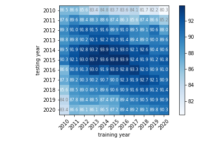

# Item category prediction

## Set up
### Install extra requires
- `torch==1.9.0`

```
$ pip install shift15m
$ pip install torch==1.9.0"
```

Or, clone this repository and run poetry install with extras packages.

```
$ git clone https://github.com/st-tech/zozo-shift15m.git
$ cd zozo-shift15m
$ poetry install
$ poetry run pip install torch==1.9.0
```

### Preparing dataset
1. Put the [item catalog](https://research.zozo.com/data_release/shift15m/item_category_prediction/item_catalog.txt) in `{repository_root}/data/` .

```
$ wget https://research.zozo.com/data_release/shift15m/item_category_prediction/item_catalog.txt -O data/item_catalog.txt
```

2. Unzip the item features and put them in `{repository_root}/data/features/` .

The location of the data is defined in [shift15m.constants](./../../shift15m/constants.py).

## Run

```
$ poetry run python benchmarks/item_category_prediction/main.py
```


